# Entity Relationship Diagram — Phases 1 to 3

Covers the Identity, Catalog, and Sync modules as built. Sales, Inventory, and
Payments arrive in Phases 4–6 and are shown as stubs where they are already
referenced.

Every table below except `Tenants` carries `TenantId`. It is omitted from the
diagram for readability, but its absence on a table would be a bug — the query
filter is applied by marker interface, so a missing `ITenantScoped` means a
missing filter.

## Identity and organisation

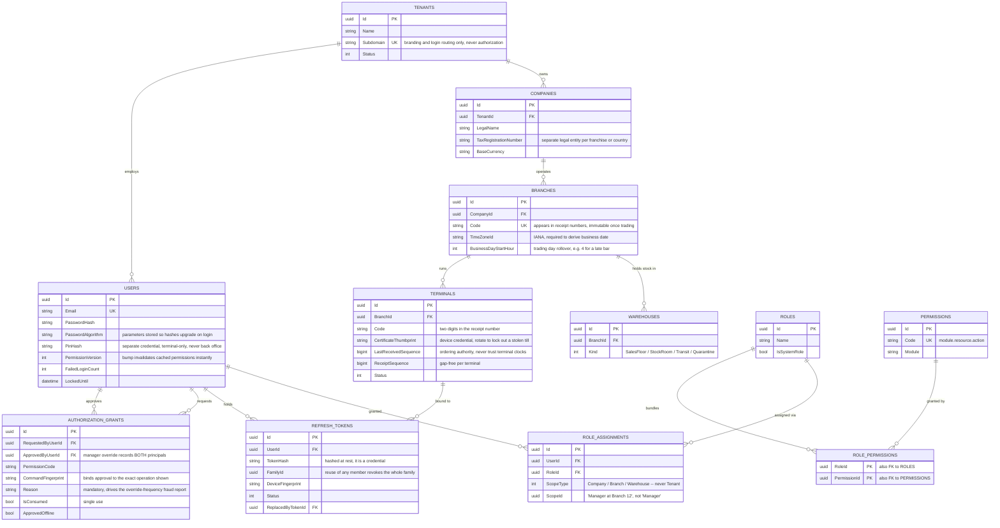

## Catalog

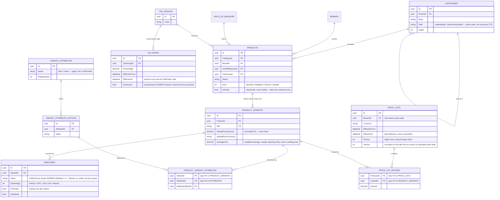

## Sync

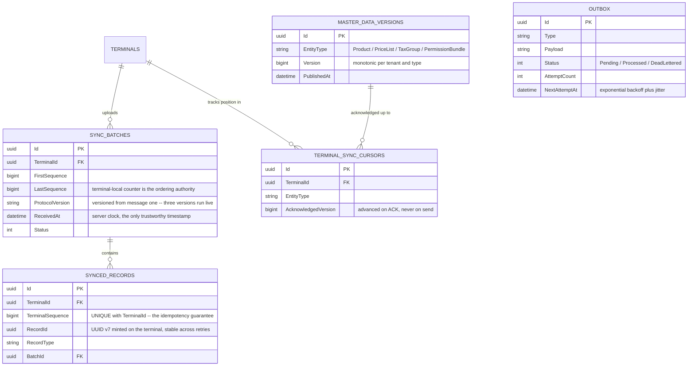

## Sync direction, stated as a constraint

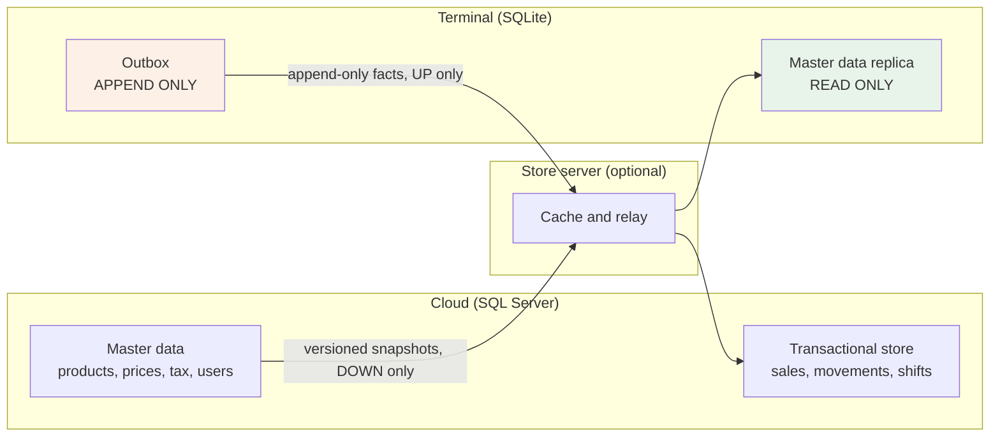

Neither side ever mutates the same row, so there are effectively **no merge
conflicts**. A store-level price override is not an edit to the central record —
it is a new master-data record published downward. Any proposal for bidirectional
sync of a mutable products table with last-write-wins should be rejected; that is
the design that produces the classic bug where a store's price silently reverts
overnight.

## Inventory (Phase 4)

The ledger and its projection. `STOCK_MOVEMENTS` is append-only and authoritative;
`STOCK_BALANCES` is derived and rebuildable. Note that neither carries `IsDeleted` —
an append-only ledger row cannot be soft-deleted without contradiction.

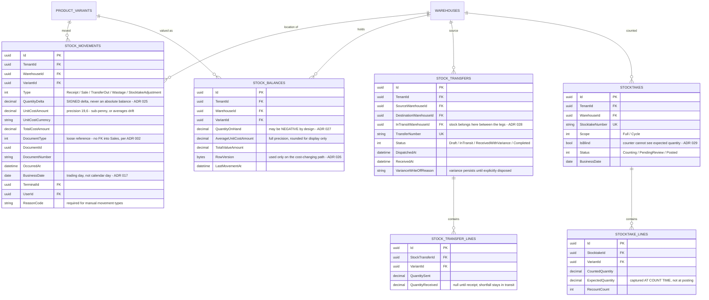

### Index rationale

| Index | Serves |
|---|---|
| `IX_StockMovements_Balance` (Tenant, Warehouse, Variant, OccurredAt) | Balance rebuild and reconciliation — the module's defining query |
| `IX_StockMovements_BusinessDate` | Daily stock reporting and period close |
| `IX_StockMovements_Document` | "Why did this sale not reduce stock?" — the commonest support query |
| `UX_StockBalances_Warehouse_Variant` | Guarantees the relative-UPDATE fast path touches exactly one row |
| `IX_StockBalances_Negative` (filtered) | Cheap negative-stock exception report |
| `IX_StockTransfers_Status` | Finds transfers stuck in transit, which are lost or stolen |

## Sales (Phase 5)

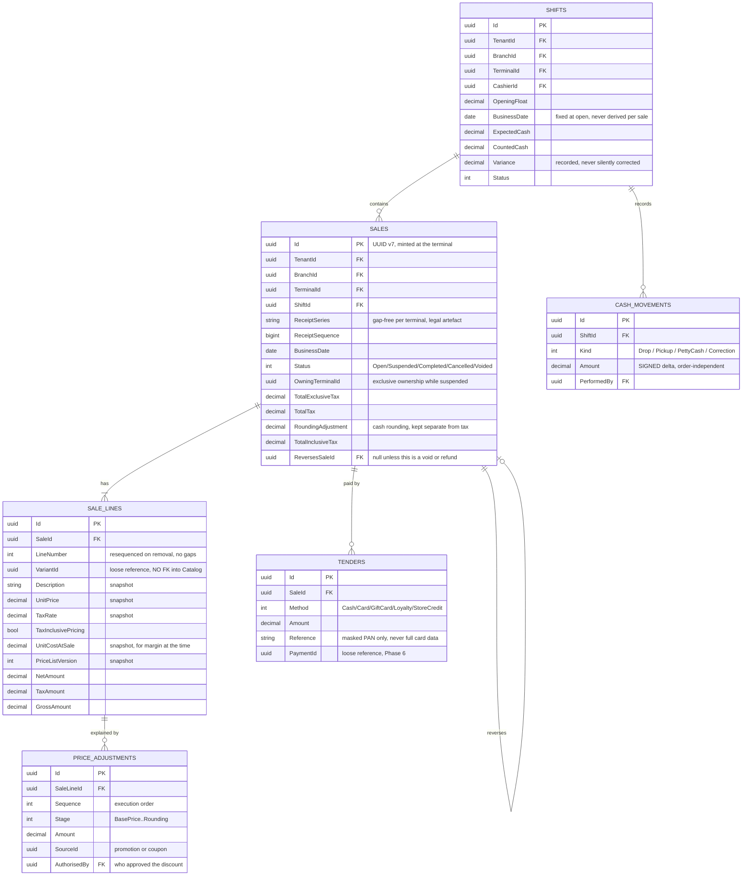

Everything on a sale line is a **snapshot**. There is deliberately no foreign key from
`SALE_LINES` into Catalog, because catalog data is mutable and a sale is a historical
fact — a live reference would let a price list edit rewrite what a customer was
charged last March.

### Index rationale — Sales

| Index | Purpose |
|---|---|
| `UX_Sales_Terminal_Receipt` on (TenantId, TerminalId, ReceiptSeries, ReceiptSequence) | Enforces gap-free per-terminal numbering; the uniqueness constraint IS the fiscal guarantee |
| `IX_Sales_BusinessDate` on (TenantId, BranchId, BusinessDate) | Every daily report and Z report filters on this |
| `IX_Sales_Status_Suspended` filtered `WHERE Status = 1` | Suspended-sale lookup is frequent and the set is tiny; a filtered index keeps it in memory |
| `IX_SaleLines_Variant` on (TenantId, VariantId) | Product sales history and margin reporting |
| `IX_Sales_Shift` on (ShiftId) | Shift close must total its own sales |

---

## Fiscal (Phase 5 foundation)

The fiscal module is **country-agnostic** (ADR 031). Nothing in this schema encodes a
jurisdiction's rules; the jurisdiction supplies the payload and the status transitions
through plugin seams, and the schema stores the outcome.

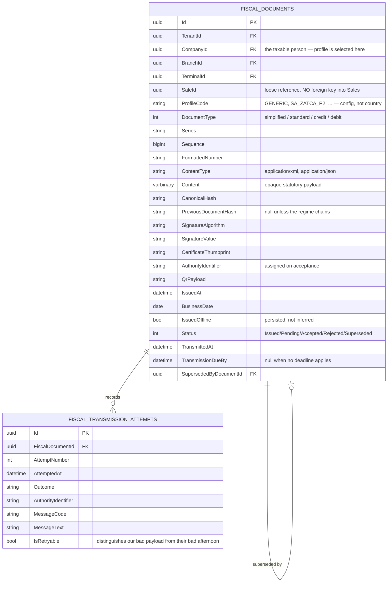

`SaleId` carries **no foreign key**, deliberately. Fiscal never references Sales and
Sales never references Fiscal (ADR 033), so the database cannot enforce the
relationship. That is a real cost, and it is paid knowingly: the alternative couples
sale completion to a government web service. The mitigation is a reconciliation report
— sales without documents, documents without sales — which is **mandatory, not
optional**, and is still unbuilt.

`Content` is stored as bytes rather than parsed columns because the core must be able
to store, hash, queue and archive a payload it cannot interpret. Parsing it would
require the core to understand UBL, FatturaPA and CFDI — precisely what ADR 031 forbids.

### Index rationale — Fiscal

| Index | Purpose |
|---|---|
| `UX_FiscalDocuments_Series` on (TenantId, CompanyId, TerminalId, Series, Sequence) | The gap-free guarantee. Uniqueness here *is* the legal numbering constraint, the same way it is for receipts |
| `IX_FiscalDocuments_Pending` filtered `WHERE Status IN (0,1)` | The transmission worker's queue. Filtered because the pending set is tiny relative to history and should stay resident |
| `IX_FiscalDocuments_Overdue` on (TransmissionDueBy) filtered `WHERE TransmissionDueBy IS NOT NULL AND Status IN (0,1)` | Deadline monitoring. This is an **alarm**, not a queue: a store 20 hours into a 24-hour obligation needs support paged before the deadline, not a retry loop |
| `IX_FiscalDocuments_Sale` on (TenantId, SaleId) | Receipt reprint, and the reconciliation report that substitutes for the missing foreign key |
| `IX_FiscalDocuments_BusinessDate` on (TenantId, CompanyId, BusinessDate) | Periodic statutory filing and archive export |

**Not yet built.** There is no `FiscalDbContext`, no EF configuration, and no
migration. The schema above is the design the pipeline implies; it has not been
expressed in code. Recorded in the debt register rather than left implicit.

## Payments (Phase 6)

Payment is its **own aggregate**, not a child of Sale (ADR 041), for the same reason
FiscalDocument is: a sale is complete when the customer has been charged and handed a
receipt, and a payment's lifecycle continues afterwards — settlement lands the next
banking day, a chargeback can arrive months later. Nesting the one inside the other
would force the shorter-lived aggregate to stay loaded for the longer-lived one.

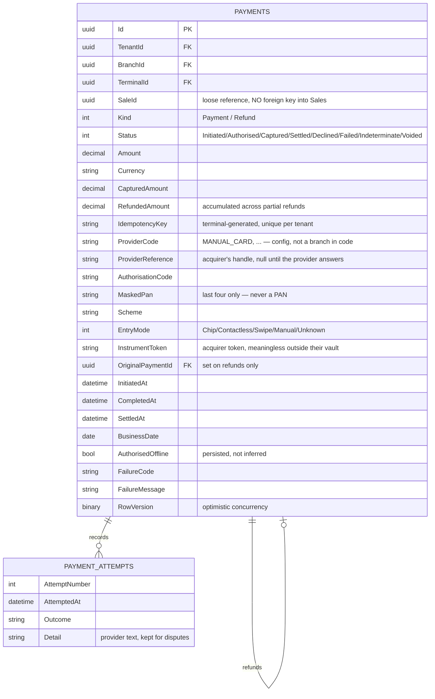

`SaleId` carries **no foreign key**, on the same reasoning as Fiscal and at the same
cost: the database cannot enforce it, so a **Sale ↔ Payment reconciliation report** is
mandatory. That is now the third mandatory reconciliation (Sale↔Fiscal, Sale↔Payment,
Payment↔settlement) and **none of the three is built**. This is the largest documented
debt Phase 6 leaves behind.

There is no `Pan`, `Cvv`, `ExpiryMonth` or `TrackData` column, and there is no way to
add one quietly: `CardDataArchitectureTests` fails the build on those identifiers
(ADR 045). `MaskedPan` holds last four; `InstrumentToken` is the acquirer's token,
which is worthless to an attacker who does not also hold the acquirer's vault.

`PAYMENT_ATTEMPTS` has no surrogate key in the design because it is an owned collection
of the payment, ordered by `AttemptNumber` within it. It exists for support and dispute
evidence, not for querying across payments.

### Index rationale — Payments

| Index | Purpose |
|---|---|
| `UX_Payments_Idempotency` on (TenantId, IdempotencyKey) **unique** | The thing that actually stops a double charge. An application-level "have I seen this key" check races between the lookup and the insert; a unique index does not (ADR 043) |
| `IX_Payments_Sale` on (TenantId, SaleId) | Receipt reprint, refund-to-original-tender lookup, and the reconciliation that substitutes for the missing foreign key |
| `IX_Payments_Unresolved` filtered `WHERE Status = Indeterminate` | The resolution sweep's work queue. Filtered because unresolved payments are rare and must stay resident — every row here is a customer who may have been charged for a sale we have no record of (ADR 044) |
| `IX_Payments_Settlement` on (TenantId, ProviderCode, BusinessDate) INCLUDE (ProviderReference, Amount) | Drives the daily settlement reconciliation without touching the base table |
| `IX_Payments_Original` on (TenantId, OriginalPaymentId) filtered `WHERE OriginalPaymentId IS NOT NULL` | Sums prior refunds when validating a new one |

**Not yet built.** There is no `PaymentDbContext`, no EF configuration, and no
migration — the same gap Sales and Fiscal have. The schema above is the design the
aggregate implies. `RefundedAmount` is persisted rather than derived by summing linked
refunds specifically so that the over-refund check is a single-row read under the
aggregate's own concurrency token, not a query whose result is stale the moment it
returns.

---

## Purchasing & Expenses (Phase 7)

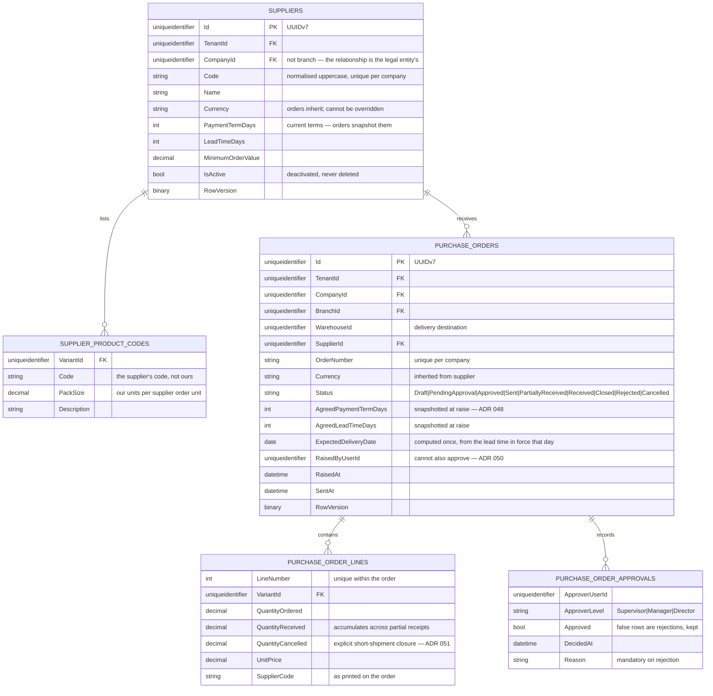

`OutstandingQuantity` and `OverReceivedQuantity` are **derived, not stored** —
`max(0, ordered − received − cancelled)` and `max(0, received − ordered)`. Storing them
creates two numbers that can disagree with the three they come from, and the disagreement
is always discovered by someone trying to reorder (ADR 051).

Terms are duplicated onto every order deliberately. They are historical facts about an
agreement, not current attributes of a party (ADR 048).

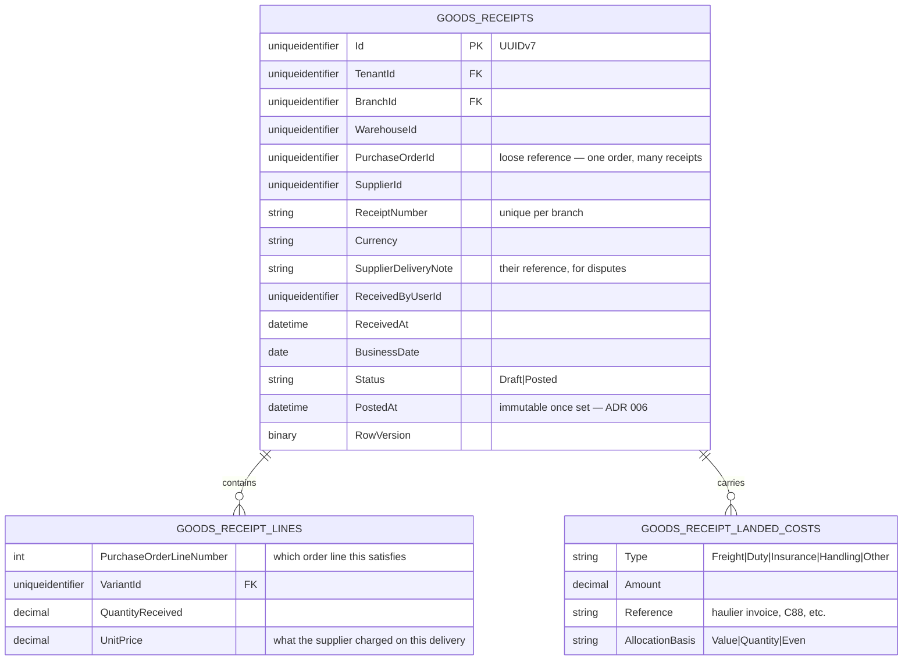

There is **no landed unit cost column**. It is computed at posting —
`(line value + allocated share) ÷ quantity` — and handed to Inventory, which stores it on
the movement. Persisting it here as well would create a second copy of a figure that must
match the stock ledger, and the two would eventually diverge.

`PurchaseOrderId` carries no foreign key, on the now-familiar reasoning: it keeps the
modules independently deployable, and it means a **receipt ↔ order reconciliation** is the
database's substitute for the constraint it cannot enforce.

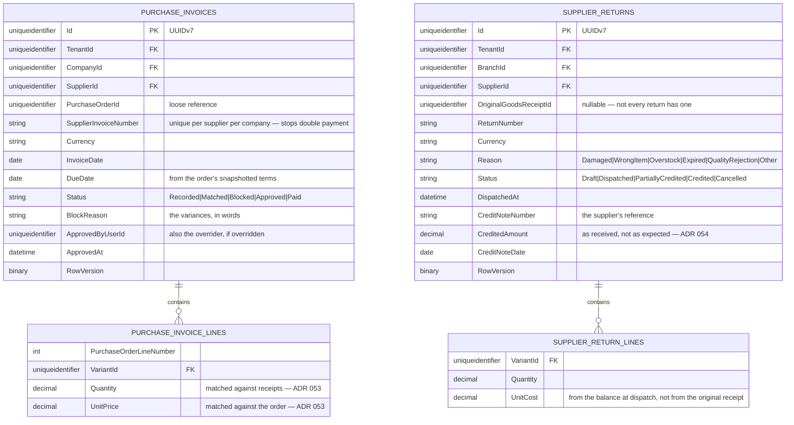

`CreditedAmount` is stored separately from the value of the return lines precisely so the
two can disagree. `CreditShortfall` — expected minus credited — is the number that
recovers money, and it only exists because nothing forces them to match (ADR 054).

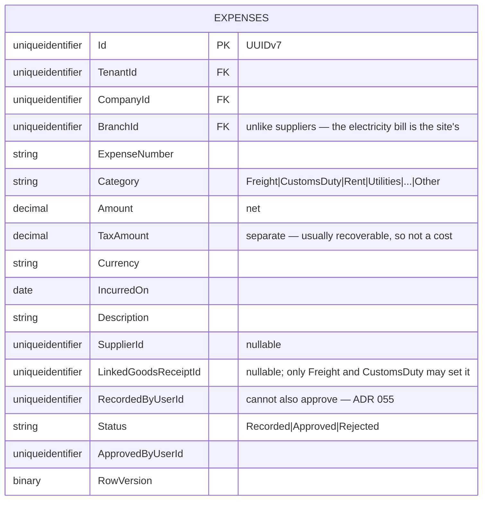

`IsCapitalised` is derived from `LinkedGoodsReceiptId IS NOT NULL`, so an expense cannot
be attached twice or counted twice. There is no "capitalisable" flag column: whether a
category may reach stock is a property of the category, held as a closed list in code
rather than as data a user can edit (ADR 055).

### Index rationale — Purchasing & Expenses

| Index | Purpose |
|---|---|
| `UX_Suppliers_Code` on (TenantId, CompanyId, Code) **unique** | Code is normalised uppercase on write so lookups are predictable and "acme" cannot coexist with "ACME" |
| `UX_SupplierProductCodes_Variant` on (SupplierId, VariantId) **unique** | One supplier code per variant. The reverse is not unique — one supplier code legitimately covers several variants |
| `UX_PurchaseOrders_Number` on (TenantId, CompanyId, OrderNumber) **unique** | Order numbers are quoted to suppliers; duplicates make every phone call ambiguous |
| `IX_PurchaseOrders_Outstanding` filtered `WHERE Status IN (Sent, PartiallyReceived)` | The goods-inwards work queue and the replenishment feed. Filtered because closed orders vastly outnumber open ones and only open ones are ever asked about |
| `IX_PurchaseOrders_Supplier` on (TenantId, SupplierId, RaisedAt) | Supplier spend analysis and the "what is coming from them" question |
| `IX_GoodsReceipts_Order` on (TenantId, PurchaseOrderId) | Substitutes for the absent foreign key; also assembles the receipt set for three-way matching, where an incomplete set produces a false block |
| `IX_GoodsReceipts_Unposted` filtered `WHERE Status = Draft` | Deliveries booked in but never posted — stock physically present and invisible to the system |
| `UX_PurchaseInvoices_SupplierNumber` on (TenantId, CompanyId, SupplierId, SupplierInvoiceNumber) **unique** | The commonest expensive mistake in accounts payable is paying the same invoice twice. A constraint, not a rule someone has to remember (ADR 053) |
| `IX_PurchaseInvoices_Blocked` filtered `WHERE Status = Blocked` | The exceptions queue. Every row is money held back and a supplier who will telephone |
| `IX_PurchaseInvoices_Due` on (TenantId, Status, DueDate) | Payment run selection and ageing |
| `IX_SupplierReturns_Uncredited` filtered `WHERE Status IN (Dispatched, PartiallyCredited)` | **The report that recovers real money** — goods gone back, credit not received (ADR 054) |
| `IX_Expenses_Branch` on (TenantId, BranchId, IncurredOn) | Per-site expense reporting, which is how expenses are almost always asked about |
| `IX_Expenses_Unapplied` filtered `WHERE LinkedGoodsReceiptId IS NOT NULL` | Freight linked to a delivery but never applied as a landed cost — a gap ADR 055 creates and does not close |

**Not yet built.** There is no `PurchasingDbContext`, no `ExpensesDbContext`, no EF
configuration and no migration. Everything above is the design the aggregates imply, and
it joins Sales, Fiscal and Payments in the deferred infrastructure milestone (ADR 046).
