# Sequence Diagrams

Only the flows where the interaction is non-obvious or where getting it wrong is
expensive.

## 1. Offline sale — the flow the whole architecture exists to serve

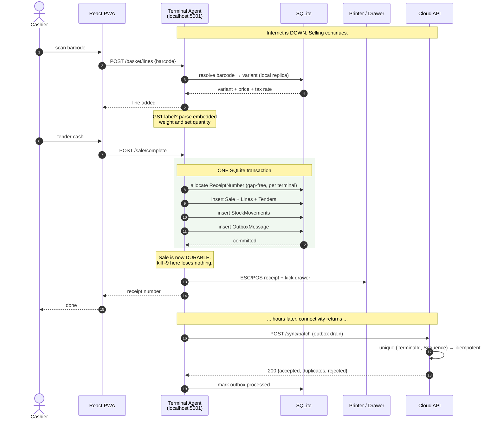
```mermaid
sequenceDiagram
    autonumber
    actor Cashier
    participant PWA as React PWA
    participant Agent as Terminal Agent<br/>(localhost:5001)
    participant DB as SQLite
    participant HW as Printer / Drawer
    participant Cloud as Cloud API

    Note over Agent,Cloud: Internet is DOWN. Selling continues.

    Cashier->>PWA: scan barcode
    PWA->>Agent: POST /basket/lines {barcode}
    Agent->>DB: resolve barcode → variant (local replica)
    DB-->>Agent: variant + price + tax rate
    Agent-->>PWA: line added

    Note over Agent: GS1 label? parse embedded<br/>weight and set quantity

    Cashier->>PWA: tender cash
    PWA->>Agent: POST /sale/complete

    rect rgb(240, 248, 240)
        Note over Agent,DB: ONE SQLite transaction
        Agent->>DB: allocate ReceiptNumber (gap-free, per terminal)
        Agent->>DB: insert Sale + Lines + Tenders
        Agent->>DB: insert StockMovements
        Agent->>DB: insert OutboxMessage
        DB-->>Agent: committed
    end

    Note over Agent: Sale is now DURABLE.<br/>kill -9 here loses nothing.

    Agent->>HW: ESC/POS receipt + kick drawer
    Agent-->>PWA: receipt number
    PWA-->>Cashier: done

    Note over Agent,Cloud: ... hours later, connectivity returns ...

    Agent->>Cloud: POST /sync/batch (outbox drain)
    Cloud->>Cloud: unique (TerminalId, Sequence) → idempotent
    Cloud-->>Agent: 200 {accepted, duplicates, rejected}
    Agent->>DB: mark outbox processed
```

The critical property: **the sale is committed locally before anything else
happens**. Hardware failure, network failure, or process death after that point
cannot lose the transaction. The outbox is only marked processed once the server
has acknowledged, so a dropped response causes a harmless re-send.

## 2. Refresh token rotation with reuse detection

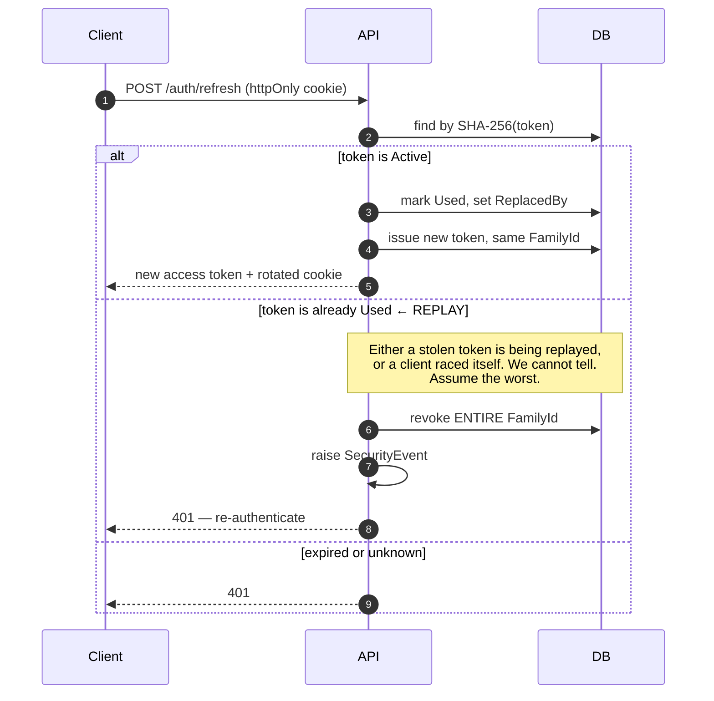
```mermaid
sequenceDiagram
    autonumber
    participant Client
    participant API
    participant DB

    Client->>API: POST /auth/refresh (httpOnly cookie)
    API->>DB: find by SHA-256(token)

    alt token is Active
        API->>DB: mark Used, set ReplacedBy
        API->>DB: issue new token, same FamilyId
        API-->>Client: new access token + rotated cookie

    else token is already Used  ← REPLAY
        Note over API,DB: Either a stolen token is being replayed,<br/>or a client raced itself. We cannot tell.<br/>Assume the worst.
        API->>DB: revoke ENTIRE FamilyId
        API->>API: raise SecurityEvent
        API-->>Client: 401 — re-authenticate

    else expired or unknown
        API-->>Client: 401
    end
```

This is what converts a stolen refresh token from a silent, persistent backdoor
into a **detectable, self-limiting incident**: the attacker's first use locks out
the victim, who reports it.

## 3. Manager override

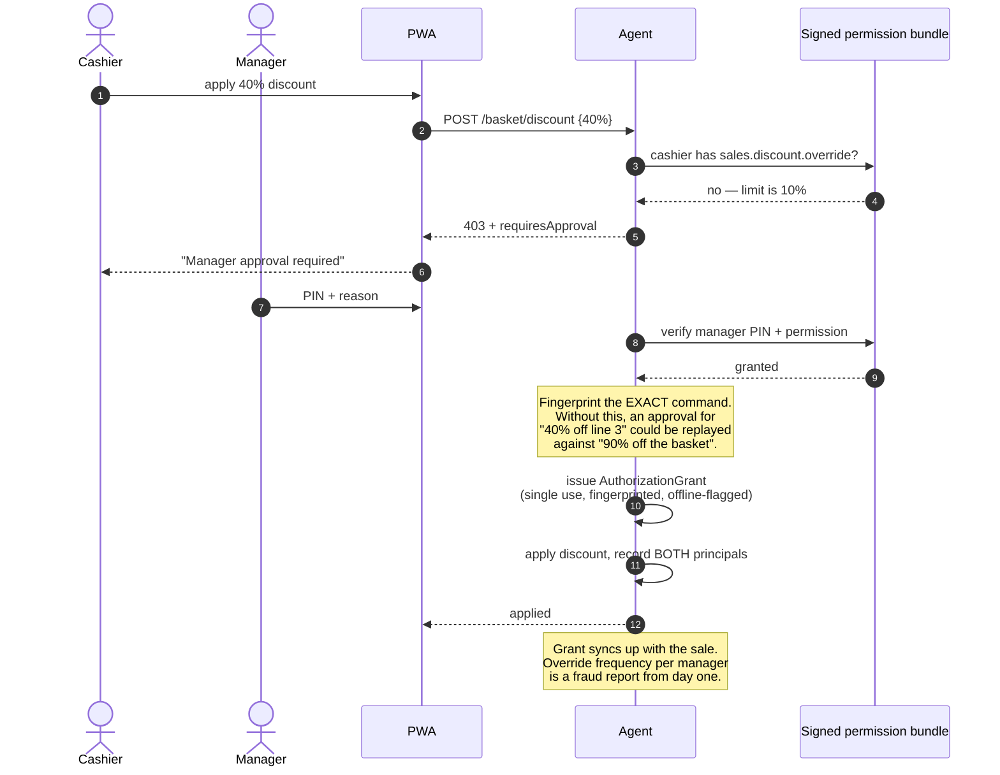
```mermaid
sequenceDiagram
    autonumber
    actor Cashier
    actor Manager
    participant PWA
    participant Agent
    participant Bundle as Signed permission bundle

    Cashier->>PWA: apply 40% discount
    PWA->>Agent: POST /basket/discount {40%}
    Agent->>Bundle: cashier has sales.discount.override?
    Bundle-->>Agent: no — limit is 10%
    Agent-->>PWA: 403 + requiresApproval

    PWA-->>Cashier: "Manager approval required"
    Manager->>PWA: PIN + reason

    Agent->>Bundle: verify manager PIN + permission
    Bundle-->>Agent: granted

    Note over Agent: Fingerprint the EXACT command.<br/>Without this, an approval for<br/>"40% off line 3" could be replayed<br/>against "90% off the basket".

    Agent->>Agent: issue AuthorizationGrant<br/>(single use, fingerprinted, offline-flagged)
    Agent->>Agent: apply discount, record BOTH principals
    Agent-->>PWA: applied

    Note over Agent: Grant syncs up with the sale.<br/>Override frequency per manager<br/>is a fraud report from day one.
```

## 4. Master data pull with full-snapshot fallback

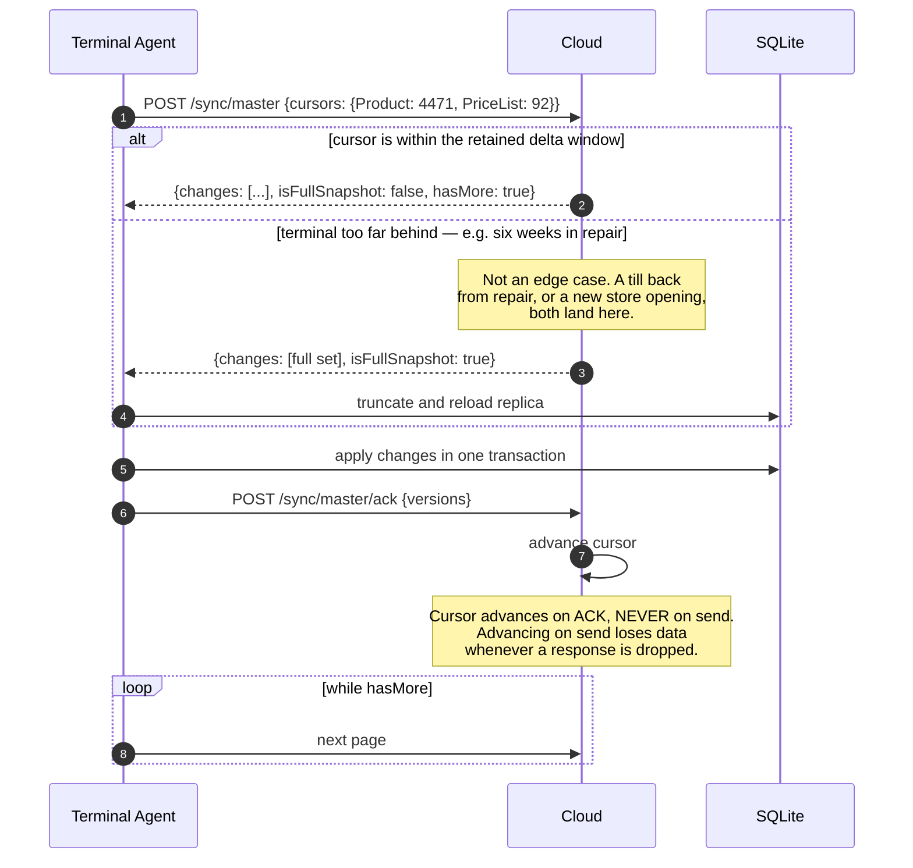
```mermaid
sequenceDiagram
    autonumber
    participant Agent as Terminal Agent
    participant Cloud
    participant DB as SQLite

    Agent->>Cloud: POST /sync/master {cursors: {Product: 4471, PriceList: 92}}

    alt cursor is within the retained delta window
        Cloud-->>Agent: {changes: [...], isFullSnapshot: false, hasMore: true}
    else terminal too far behind — e.g. six weeks in repair
        Note over Cloud: Not an edge case. A till back<br/>from repair, or a new store opening,<br/>both land here.
        Cloud-->>Agent: {changes: [full set], isFullSnapshot: true}
        Agent->>DB: truncate and reload replica
    end

    Agent->>DB: apply changes in one transaction
    Agent->>Cloud: POST /sync/master/ack {versions}
    Cloud->>Cloud: advance cursor

    Note over Cloud: Cursor advances on ACK, NEVER on send.<br/>Advancing on send loses data<br/>whenever a response is dropped.

    loop while hasMore
        Agent->>Cloud: next page
    end
```

## 5. Tenant resolution and the three enforcement layers

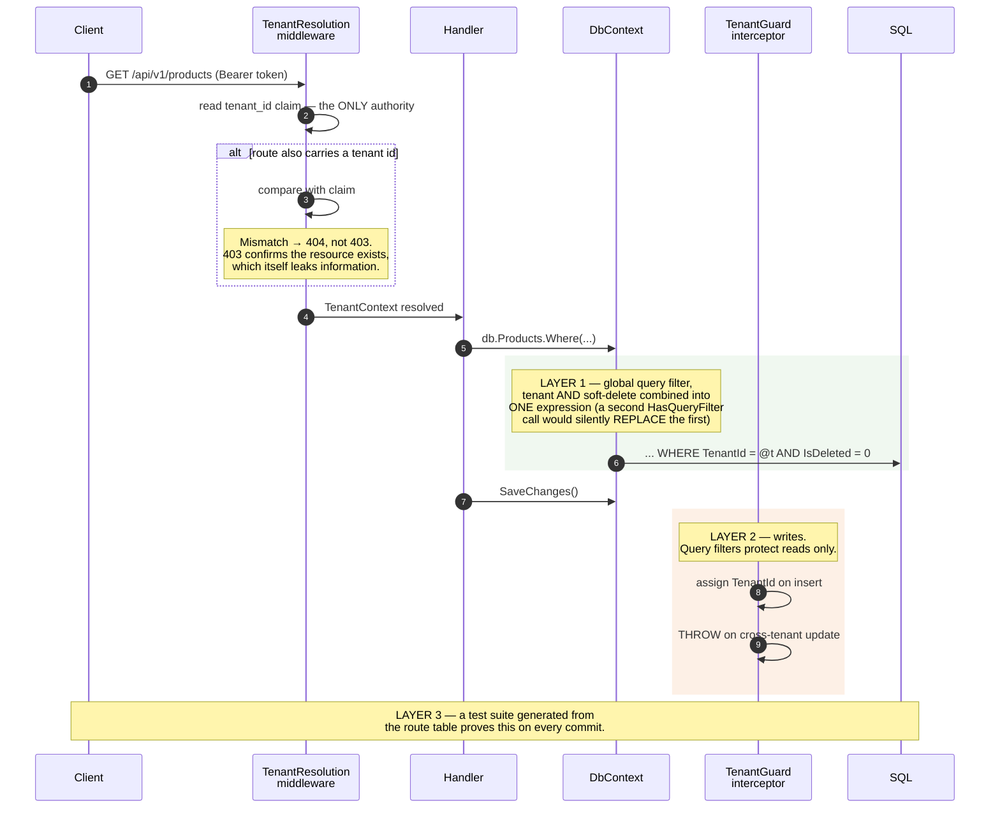
```mermaid
sequenceDiagram
    autonumber
    participant Client
    participant MW as TenantResolution<br/>middleware
    participant Handler
    participant EF as DbContext
    participant Guard as TenantGuard<br/>interceptor
    participant SQL

    Client->>MW: GET /api/v1/products (Bearer token)
    MW->>MW: read tenant_id claim — the ONLY authority

    alt route also carries a tenant id
        MW->>MW: compare with claim
        Note over MW: Mismatch → 404, not 403.<br/>403 confirms the resource exists,<br/>which itself leaks information.
    end

    MW->>Handler: TenantContext resolved
    Handler->>EF: db.Products.Where(...)

    rect rgb(240, 248, 240)
        Note over EF: LAYER 1 — global query filter,<br/>tenant AND soft-delete combined into<br/>ONE expression (a second HasQueryFilter<br/>call would silently REPLACE the first)
        EF->>SQL: ... WHERE TenantId = @t AND IsDeleted = 0
    end

    Handler->>EF: SaveChanges()

    rect rgb(253, 240, 230)
        Note over Guard: LAYER 2 — writes.<br/>Query filters protect reads only.
        Guard->>Guard: assign TenantId on insert
        Guard->>Guard: THROW on cross-tenant update
    end

    Note over Client,SQL: LAYER 3 — a test suite generated from<br/>the route table proves this on every commit.
```

## 6. Shift lifecycle and the business date

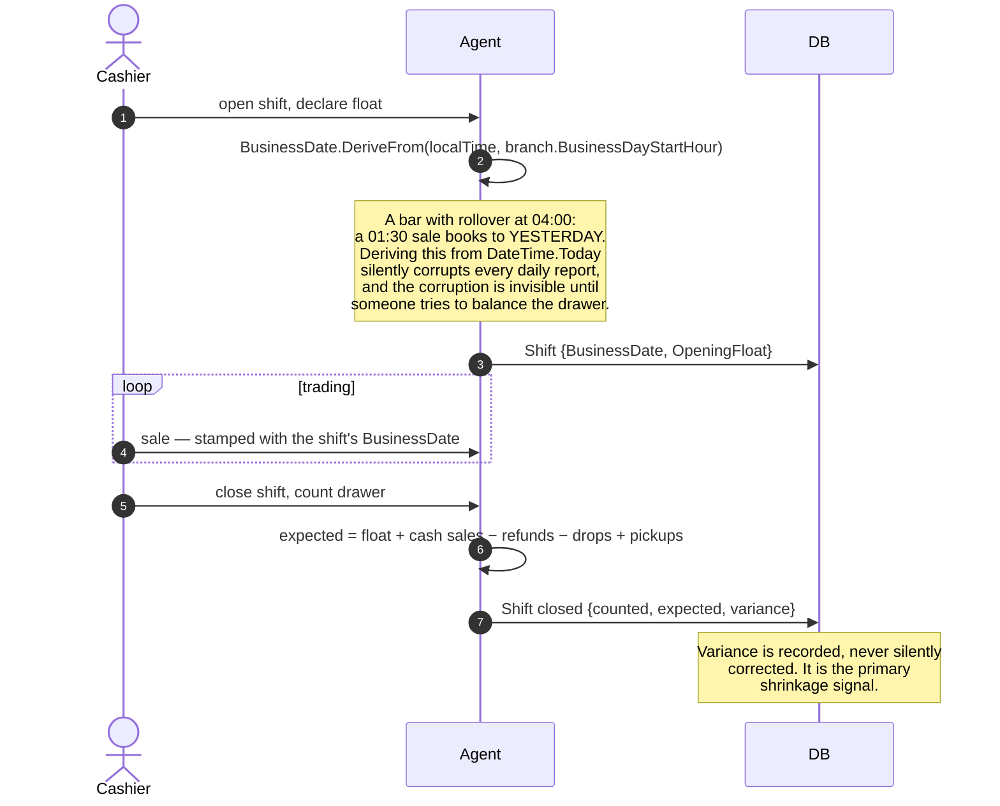
```mermaid
sequenceDiagram
    autonumber
    actor Cashier
    participant Agent
    participant DB

    Cashier->>Agent: open shift, declare float
    Agent->>Agent: BusinessDate.DeriveFrom(localTime, branch.BusinessDayStartHour)

    Note over Agent: A bar with rollover at 04:00:<br/>a 01:30 sale books to YESTERDAY.<br/>Deriving this from DateTime.Today<br/>silently corrupts every daily report,<br/>and the corruption is invisible until<br/>someone tries to balance the drawer.

    Agent->>DB: Shift {BusinessDate, OpeningFloat}

    loop trading
        Cashier->>Agent: sale — stamped with the shift's BusinessDate
    end

    Cashier->>Agent: close shift, count drawer
    Agent->>Agent: expected = float + cash sales − refunds − drops + pickups
    Agent->>DB: Shift closed {counted, expected, variance}

    Note over DB: Variance is recorded, never silently<br/>corrected. It is the primary<br/>shrinkage signal.
```

---

## 7. Offline sale to stock movement — why signed deltas make this work

The diagram the Inventory module exists to justify. Two terminals sell the same
variant while disconnected from each other and from the server, and the server
still arrives at the correct balance without any conflict resolution.

```mermaid
sequenceDiagram
    autonumber
    participant T1 as Terminal 1 (offline)
    participant T2 as Terminal 2 (offline)
    participant API as Sync API
    participant L as StockLedger
    participant DB as SQL Server

    Note over T1,T2: Server balance for VAR-1 is 10.<br/>Neither terminal can see the other.

    T1->>T1: sell 3 → movement {type: Sale, delta: −3}
    T2->>T2: sell 4 → movement {type: Sale, delta: −4}

    Note over T1,T2: Each records a CHANGE, not a belief<br/>about the total. T1 never writes "7"<br/>and T2 never writes "6" — those would<br/>be irreconcilable claims about one number.

    T1->>API: outbox batch {movement −3, terminalSeq 41}
    API->>L: RecordAsync(movement, policy)
    L->>DB: UPDATE StockBalances SET QtyOnHand = QtyOnHand − 3
    Note over L,DB: Relative UPDATE, not read-modify-write.<br/>The database applies the delta under its<br/>own row lock; no version check, no retry,<br/>no lost update. See ADR 026.
    DB-->>L: 1 row affected
    L-->>API: Ok
    API-->>T1: ack seq 41

    T2->>API: outbox batch {movement −4, terminalSeq 17}
    API->>L: RecordAsync(movement, policy)
    L->>DB: UPDATE StockBalances SET QtyOnHand = QtyOnHand − 4
    DB-->>L: 1 row affected
    L-->>API: Ok
    API-->>T2: ack seq 17

    Note over DB: Balance is 3, and would be 3 in<br/>ANY arrival order. Commutativity is the<br/>whole property — it is what lets a till<br/>sell for a week without a network.

    rect rgb(245, 235, 235)
        Note over T1,DB: If instead the terminals had synced absolute<br/>quantities, the server would face "is it 7 or 6?"<br/>with no information capable of deciding, and<br/>would have to discard one real sale.
    end
```

The arithmetic property that makes offline stock tractable: addition commutes,
assignment does not. Every design decision in the Inventory module follows from
choosing the operation that commutes.

## 8. Cost-changing movement takes the lock the sale avoided

Not every movement can use the lock-free path. A receipt changes the weighted
average cost, which is genuinely read-modify-write.

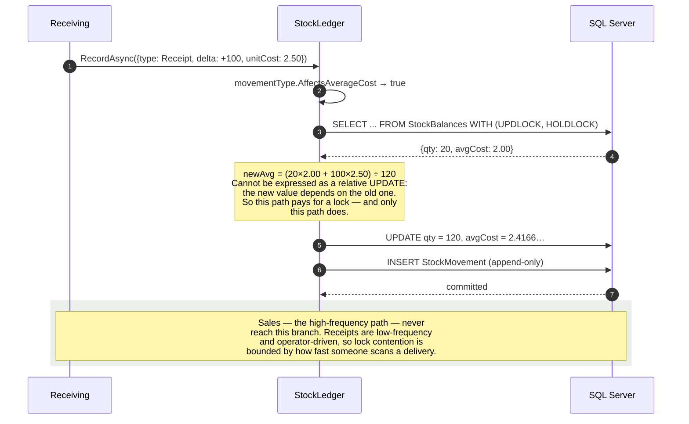
```mermaid
sequenceDiagram
    autonumber
    participant Svc as Receiving
    participant L as StockLedger
    participant DB as SQL Server

    Svc->>L: RecordAsync({type: Receipt, delta: +100, unitCost: 2.50})
    L->>L: movementType.AffectsAverageCost → true

    L->>DB: SELECT ... FROM StockBalances WITH (UPDLOCK, HOLDLOCK)
    DB-->>L: {qty: 20, avgCost: 2.00}

    Note over L: newAvg = (20×2.00 + 100×2.50) ÷ 120<br/>Cannot be expressed as a relative UPDATE:<br/>the new value depends on the old one.<br/>So this path pays for a lock — and only<br/>this path does.

    L->>DB: UPDATE qty = 120, avgCost = 2.4166…
    L->>DB: INSERT StockMovement (append-only)
    DB-->>L: committed

    rect rgb(235, 240, 235)
        Note over Svc,DB: Sales — the high-frequency path — never<br/>reach this branch. Receipts are low-frequency<br/>and operator-driven, so lock contention is<br/>bounded by how fast someone scans a delivery.
    end
```

Splitting the two paths (ADR 026) is the difference between a checkout that
serialises on a hot SKU and one that does not.

## 9. Two-leg transfer — stock is never nowhere

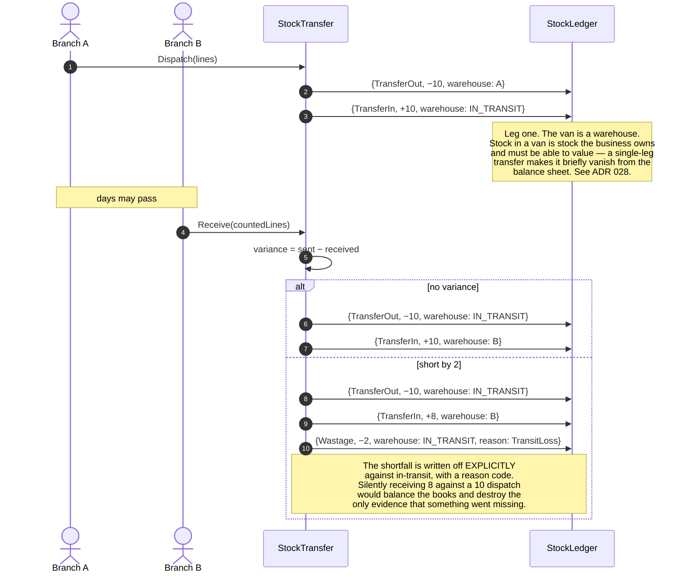
```mermaid
sequenceDiagram
    autonumber
    actor Sender as Branch A
    actor Receiver as Branch B
    participant T as StockTransfer
    participant L as StockLedger

    Sender->>T: Dispatch(lines)
    T->>L: {TransferOut, −10, warehouse: A}
    T->>L: {TransferIn, +10, warehouse: IN_TRANSIT}
    Note over L: Leg one. The van is a warehouse.<br/>Stock in a van is stock the business owns<br/>and must be able to value — a single-leg<br/>transfer makes it briefly vanish from the<br/>balance sheet. See ADR 028.

    Note over Sender,Receiver: days may pass

    Receiver->>T: Receive(countedLines)
    T->>T: variance = sent − received

    alt no variance
        T->>L: {TransferOut, −10, warehouse: IN_TRANSIT}
        T->>L: {TransferIn, +10, warehouse: B}
    else short by 2
        T->>L: {TransferOut, −10, warehouse: IN_TRANSIT}
        T->>L: {TransferIn, +8, warehouse: B}
        T->>L: {Wastage, −2, warehouse: IN_TRANSIT, reason: TransitLoss}
        Note over T,L: The shortfall is written off EXPLICITLY<br/>against in-transit, with a reason code.<br/>Silently receiving 8 against a 10 dispatch<br/>would balance the books and destroy the<br/>only evidence that something went missing.
    end
```

## 10. Stocktake posts adjustments; it never sets the balance

```mermaid
sequenceDiagram
    autonumber
    actor Counter
    participant S as Stocktake
    participant L as StockLedger

    Counter->>S: Start(scope)
    Note over S,Counter: Blind count — the expected quantity is<br/>NOT shown. Displaying it produces counts<br/>that agree with the system rather than<br/>with the shelf. See ADR 029.

    Counter->>S: RecordCount(variant, counted: 47)
    S->>L: GetOnHandAsync → expected 50
    S->>S: line {counted: 47, expected: 50, variance: −3}

    Note over S: Expected is captured AT COUNT TIME,<br/>not at post time. Trading continues during<br/>a count; comparing tonight's count against<br/>tomorrow's balance manufactures variance.

    Counter->>S: CompleteCounting()
    Counter->>S: Post()

    loop each line with variance
        S->>L: {StocktakeAdjustment, delta: −3, reason}
    end

    Note over L: The ledger is APPENDED to, never<br/>overwritten. sum(movements) = balance still<br/>holds after a stocktake, so the rebuild<br/>gate survives. A "set balance to 47"<br/>operation would break that invariant and<br/>erase the shrinkage signal — which is the<br/>single most valuable output of a count.
```

## 11. Reconciliation — proving the projection has not drifted

`StockBalances` is a materialised projection of the movement ledger. A projection
can drift; the design is only trustworthy if drift is detectable.

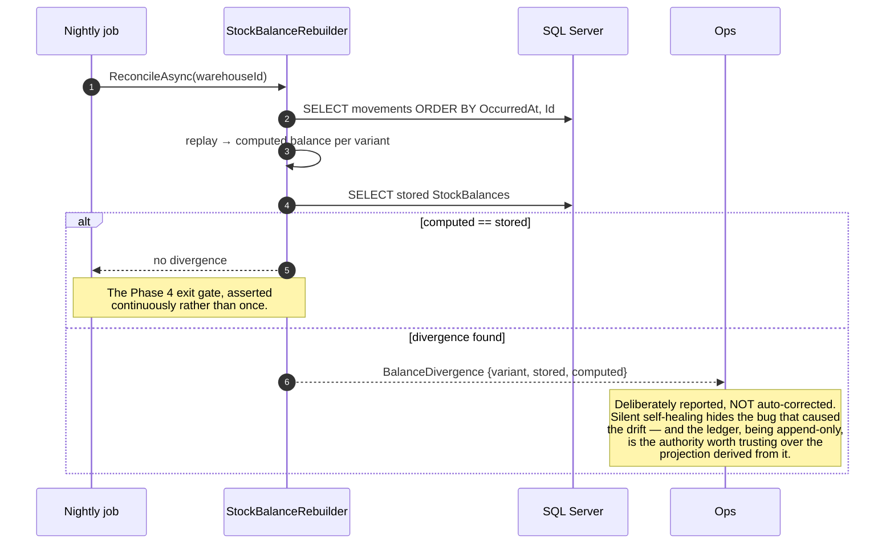
```mermaid
sequenceDiagram
    autonumber
    participant Job as Nightly job
    participant R as StockBalanceRebuilder
    participant DB as SQL Server
    participant Ops

    Job->>R: ReconcileAsync(warehouseId)
    R->>DB: SELECT movements ORDER BY OccurredAt, Id
    R->>R: replay → computed balance per variant
    R->>DB: SELECT stored StockBalances

    alt computed == stored
        R-->>Job: no divergence
        Note over R,Job: The Phase 4 exit gate, asserted<br/>continuously rather than once.
    else divergence found
        R-->>Ops: BalanceDivergence {variant, stored, computed}
        Note over Ops: Deliberately reported, NOT auto-corrected.<br/>Silent self-healing hides the bug that caused<br/>the drift — and the ledger, being append-only,<br/>is the authority worth trusting over the<br/>projection derived from it.
    end
```

The ledger is the source of truth; the balance is an optimisation. Anything that
can be rebuilt from an append-only log can be verified against it, which is the
main reason for choosing that shape in the first place.

---

## 12. Offline sale under a reporting regime — the path that keeps offline selling alive

Covers the generic profile, Egypt ETA, and ZATCA simplified invoices: the document is
legally issued at the till, and the authority is told afterwards.

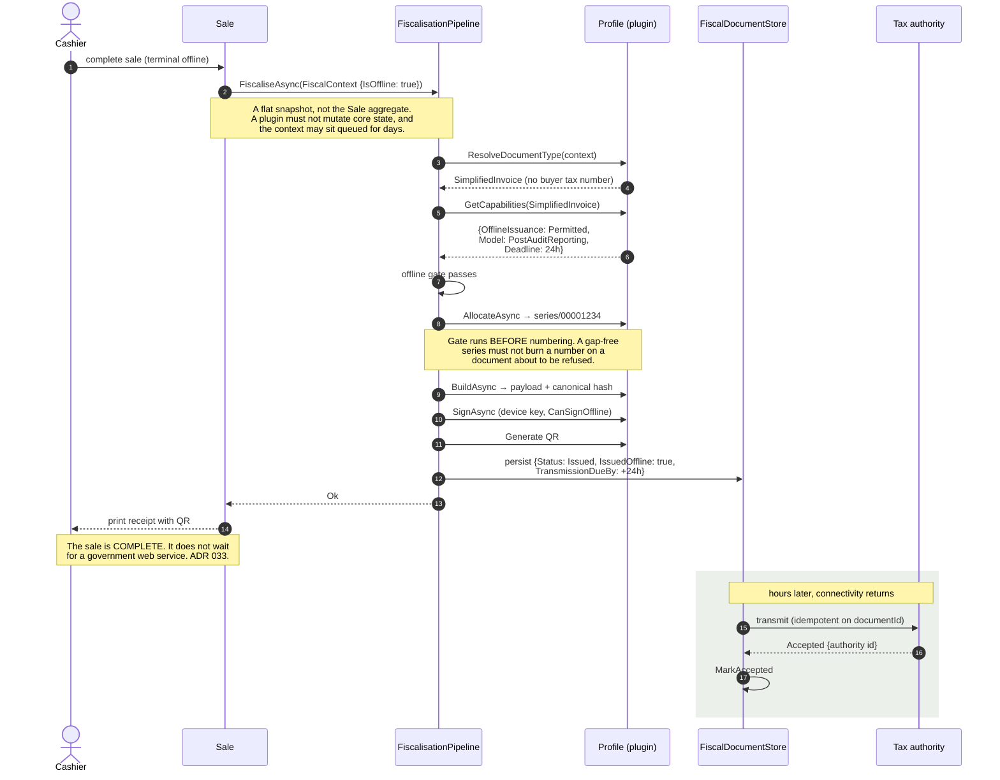
```mermaid
sequenceDiagram
    autonumber
    actor Cashier
    participant Sale
    participant P as FiscalisationPipeline
    participant Prof as Profile (plugin)
    participant Store as FiscalDocumentStore
    participant Auth as Tax authority

    Cashier->>Sale: complete sale (terminal offline)
    Sale->>P: FiscaliseAsync(FiscalContext {IsOffline: true})

    Note over Sale,P: A flat snapshot, not the Sale aggregate.<br/>A plugin must not mutate core state, and<br/>the context may sit queued for days.

    P->>Prof: ResolveDocumentType(context)
    Prof-->>P: SimplifiedInvoice (no buyer tax number)
    P->>Prof: GetCapabilities(SimplifiedInvoice)
    Prof-->>P: {OfflineIssuance: Permitted,<br/>Model: PostAuditReporting,<br/>Deadline: 24h}

    P->>P: offline gate passes
    P->>Prof: AllocateAsync → series/00001234
    Note over P,Prof: Gate runs BEFORE numbering. A gap-free<br/>series must not burn a number on a<br/>document about to be refused.

    P->>Prof: BuildAsync → payload + canonical hash
    P->>Prof: SignAsync (device key, CanSignOffline)
    P->>Prof: Generate QR
    P->>Store: persist {Status: Issued, IssuedOffline: true,<br/>TransmissionDueBy: +24h}
    P-->>Sale: Ok
    Sale-->>Cashier: print receipt with QR

    Note over Sale,Cashier: The sale is COMPLETE. It does not wait<br/>for a government web service. ADR 033.

    rect rgb(235, 240, 235)
        Note over Store,Auth: hours later, connectivity returns
        Store->>Auth: transmit (idempotent on documentId)
        Auth-->>Store: Accepted {authority id}
        Store->>Store: MarkAccepted
    end
```

## 13. Clearance regime — the refusal that protects the merchant

The same pipeline, a different capability, and a materially different outcome.

```mermaid
sequenceDiagram
    autonumber
    actor Cashier
    participant P as FiscalisationPipeline
    participant Prof as Profile (plugin)
    participant Auth as Tax authority

    Cashier->>P: B2B sale, buyer tax number supplied (OFFLINE)
    P->>Prof: ResolveDocumentType → StandardInvoice
    P->>Prof: GetCapabilities(StandardInvoice)
    Prof-->>P: {OfflineIssuance: Prohibited,<br/>Model: Clearance}

    P-->>Cashier: REFUSED — "requires clearance;<br/>issue a simplified receipt or retry when online"

    Note over P,Cashier: No number allocated, no document created.<br/>The alternative — issue anyway and reconcile<br/>later — means knowingly handing the customer<br/>an invalid invoice. ADR 032.

    rect rgb(235, 240, 235)
        Note over Cashier,Auth: same sale, terminal online
        Cashier->>P: retry
        P->>Prof: AllocateAsync / BuildAsync / SignAsync
        P->>Auth: TransmitAsync
        alt cleared
            Auth-->>P: Accepted {authority id}
            P-->>Cashier: issue receipt with cleared QR
        else rejected
            Auth-->>P: Rejected [code, text]
            P-->>Cashier: "buyer VAT number invalid"
            Note over P,Cashier: The authority's own message is surfaced.<br/>A generic failure sends the cashier to<br/>the support line; this is fixable at the till.
        end
    end
```

## 14. Rejection after the customer has left

The awkward case a reporting regime makes possible, and the reason fiscal documents
are immutable.

```mermaid
sequenceDiagram
    autonumber
    participant W as Transmission worker
    participant Doc as FiscalDocument
    participant Auth as Tax authority
    participant Ops

    W->>Auth: transmit document issued offline yesterday
    Auth-->>W: Rejected [tax code mapping invalid]

    W->>Doc: MarkRejected()
    Note over Doc: NOT deleted, NOT rewritten, NOT reissued<br/>under the same number. The customer holds<br/>a printed receipt; the record of what was<br/>handed over must survive exactly as issued.

    W->>Ops: alert — rejection requires correction
    Ops->>Doc: raise CreditNote referencing original
    Doc->>Doc: MarkSuperseded(creditNoteId)
    Note over Ops,Doc: Then a corrected document is issued.<br/>Reusing the original number would be the<br/>one thing guaranteed to fail an audit. ADR 007.

    rect rgb(245, 235, 235)
        Note over W,Ops: A systematic mapping error shows up as a<br/>BACKLOG of rejections, not an error at the till.<br/>Rejection rate is therefore a monitored metric,<br/>not an exception log.
    end
```

---

## 15. Checkout — the full path, offline

Everything from Phases 0–5 converging on the one flow the product exists to serve.

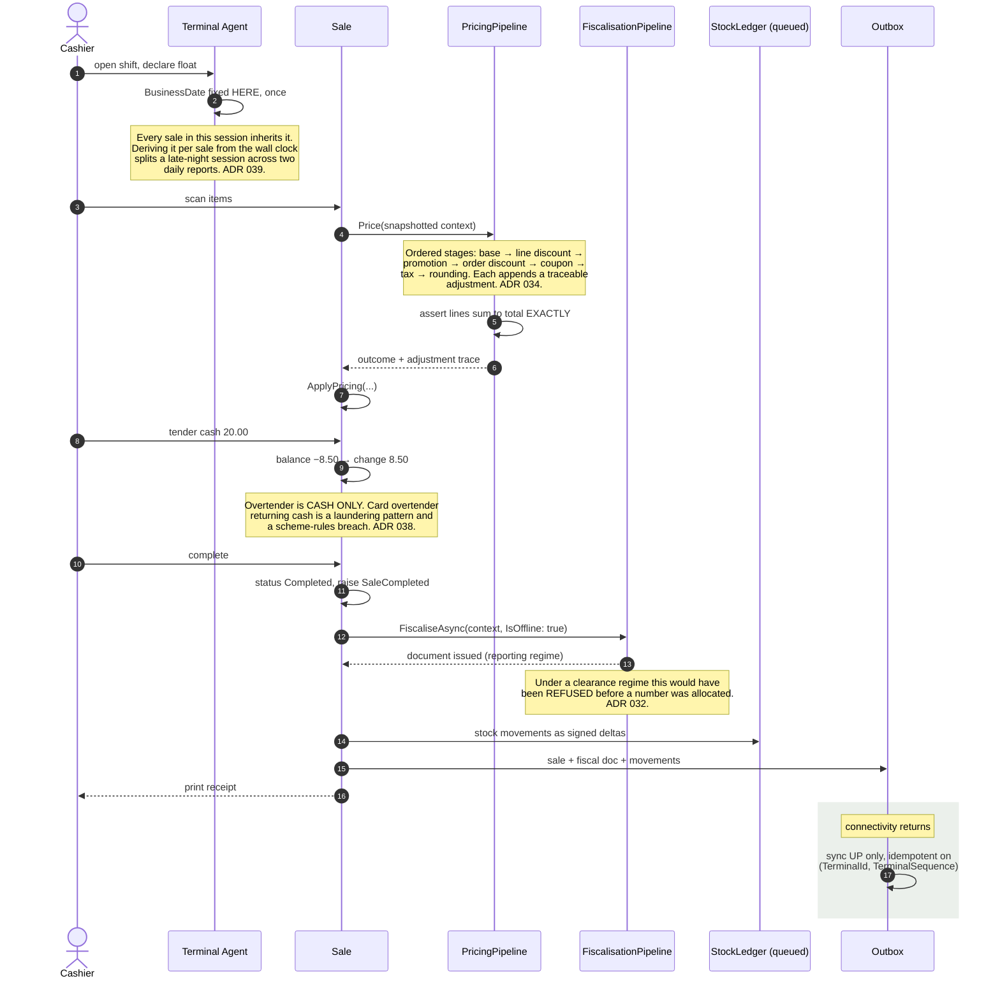
```mermaid
sequenceDiagram
    autonumber
    actor Cashier
    participant Agent as Terminal Agent
    participant Sale
    participant Price as PricingPipeline
    participant Fisc as FiscalisationPipeline
    participant Ledger as StockLedger (queued)
    participant Outbox

    Cashier->>Agent: open shift, declare float
    Agent->>Agent: BusinessDate fixed HERE, once
    Note over Agent: Every sale in this session inherits it.<br/>Deriving it per sale from the wall clock<br/>splits a late-night session across two<br/>daily reports. ADR 039.

    Cashier->>Sale: scan items
    Sale->>Price: Price(snapshotted context)

    Note over Price: Ordered stages: base → line discount →<br/>promotion → order discount → coupon →<br/>tax → rounding. Each appends a traceable<br/>adjustment. ADR 034.

    Price->>Price: assert lines sum to total EXACTLY
    Price-->>Sale: outcome + adjustment trace
    Sale->>Sale: ApplyPricing(...)

    Cashier->>Sale: tender cash 20.00
    Sale->>Sale: balance −8.50 → change 8.50
    Note over Sale: Overtender is CASH ONLY. Card overtender<br/>returning cash is a laundering pattern and<br/>a scheme-rules breach. ADR 038.

    Cashier->>Sale: complete
    Sale->>Sale: status Completed, raise SaleCompleted

    Sale->>Fisc: FiscaliseAsync(context, IsOffline: true)
    Fisc-->>Sale: document issued (reporting regime)
    Note over Fisc: Under a clearance regime this would have<br/>been REFUSED before a number was allocated.<br/>ADR 032.

    Sale->>Ledger: stock movements as signed deltas
    Sale->>Outbox: sale + fiscal doc + movements
    Sale-->>Cashier: print receipt

    rect rgb(235, 240, 235)
        Note over Outbox: connectivity returns
        Outbox->>Outbox: sync UP only, idempotent on<br/>(TerminalId, TerminalSequence)
    end
```

Nothing in this path waits on a network. That is the whole thesis of the
architecture, and every earlier decision — UUID v7 identity, per-terminal receipt
series, signed stock deltas, capability-gated fiscalisation — exists to make this one
diagram possible.

## 16. Suspend and resume across terminals — a lease, not a merge

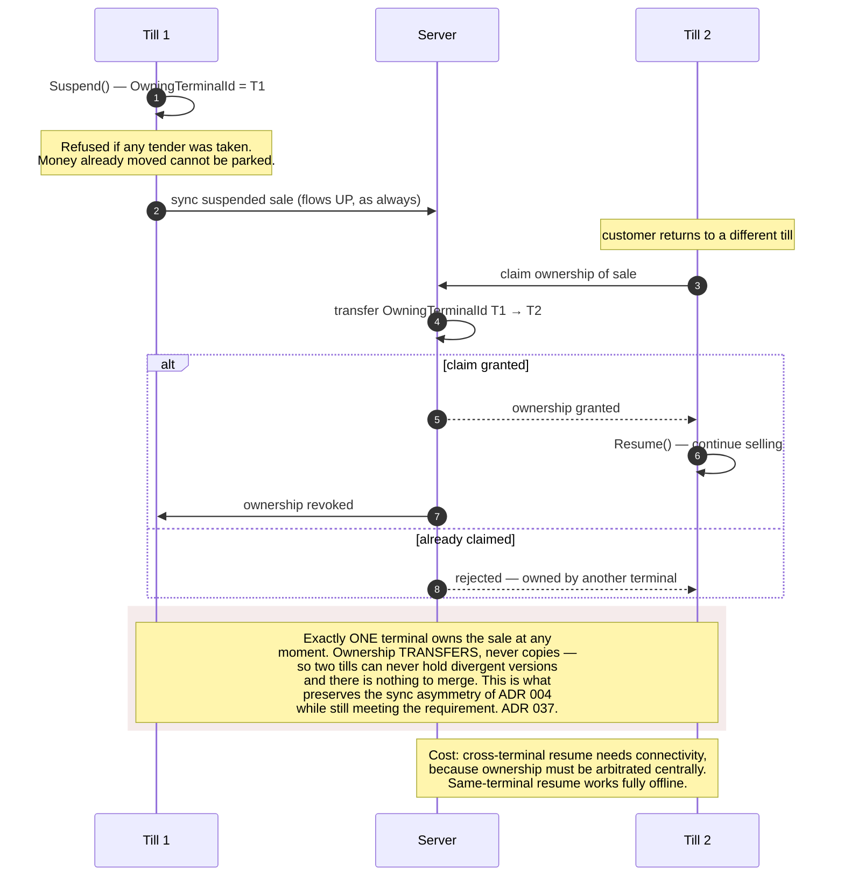
```mermaid
sequenceDiagram
    autonumber
    participant T1 as Till 1
    participant Srv as Server
    participant T2 as Till 2

    T1->>T1: Suspend() — OwningTerminalId = T1
    Note over T1: Refused if any tender was taken.<br/>Money already moved cannot be parked.

    T1->>Srv: sync suspended sale (flows UP, as always)

    Note over T2: customer returns to a different till
    T2->>Srv: claim ownership of sale
    Srv->>Srv: transfer OwningTerminalId T1 → T2

    alt claim granted
        Srv-->>T2: ownership granted
        T2->>T2: Resume() — continue selling
        Srv->>T1: ownership revoked
    else already claimed
        Srv-->>T2: rejected — owned by another terminal
    end

    rect rgb(245, 235, 235)
        Note over T1,T2: Exactly ONE terminal owns the sale at any<br/>moment. Ownership TRANSFERS, never copies —<br/>so two tills can never hold divergent versions<br/>and there is nothing to merge. This is what<br/>preserves the sync asymmetry of ADR 004<br/>while still meeting the requirement. ADR 037.
    end

    Note over T2,Srv: Cost: cross-terminal resume needs connectivity,<br/>because ownership must be arbitrated centrally.<br/>Same-terminal resume works fully offline.
```

---

## 17. Card payment survives a network cut — the Phase 6 gate

The scenario the phase exists to pass: the network dies *after* the acquirer authorised
and *before* the response reaches us. Every ordering decision below exists to make this
survivable.

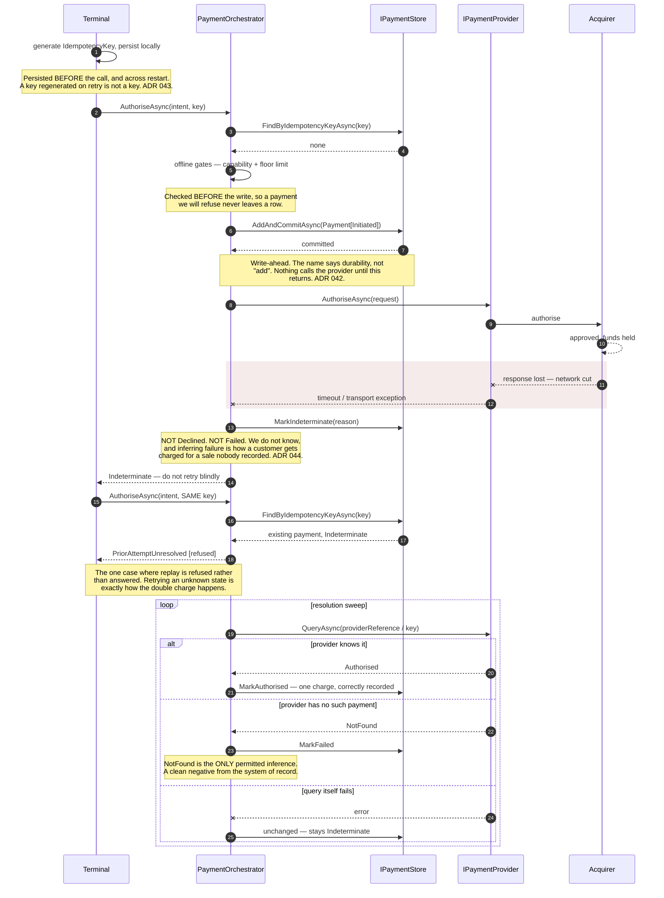
```mermaid
sequenceDiagram
    autonumber
    participant T as Terminal
    participant O as PaymentOrchestrator
    participant S as IPaymentStore
    participant P as IPaymentProvider
    participant A as Acquirer

    T->>T: generate IdempotencyKey, persist locally
    Note over T: Persisted BEFORE the call, and across restart.<br/>A key regenerated on retry is not a key. ADR 043.

    T->>O: AuthoriseAsync(intent, key)
    O->>S: FindByIdempotencyKeyAsync(key)
    S-->>O: none

    O->>O: offline gates — capability + floor limit
    Note over O: Checked BEFORE the write, so a payment<br/>we will refuse never leaves a row.

    O->>S: AddAndCommitAsync(Payment[Initiated])
    S-->>O: committed
    Note over O,S: Write-ahead. The name says durability, not<br/>"add". Nothing calls the provider until this<br/>returns. ADR 042.

    O->>P: AuthoriseAsync(request)
    P->>A: authorise
    A-->>A: approved, funds held

    rect rgb(245, 235, 235)
        A--xP: response lost — network cut
        P--xO: timeout / transport exception
    end

    O->>S: MarkIndeterminate(reason)
    Note over O: NOT Declined. NOT Failed. We do not know,<br/>and inferring failure is how a customer gets<br/>charged for a sale nobody recorded. ADR 044.

    O-->>T: Indeterminate — do not retry blindly

    T->>O: AuthoriseAsync(intent, SAME key)
    O->>S: FindByIdempotencyKeyAsync(key)
    S-->>O: existing payment, Indeterminate
    O-->>T: PriorAttemptUnresolved [refused]
    Note over O,T: The one case where replay is refused rather<br/>than answered. Retrying an unknown state is<br/>exactly how the double charge happens.

    loop resolution sweep
        O->>P: QueryAsync(providerReference / key)
        alt provider knows it
            P-->>O: Authorised
            O->>S: MarkAuthorised — one charge, correctly recorded
        else provider has no such payment
            P-->>O: NotFound
            O->>S: MarkFailed
            Note over O: NotFound is the ONLY permitted inference.<br/>A clean negative from the system of record.
        else query itself fails
            P--xO: error
            O->>S: unchanged — stays Indeterminate
        end
    end
```

The gate is met not because the network cut is prevented but because every outcome of
it lands on a row that already exists. Worst case degrades from *money moved, no
record* to *record exists, outcome unknown* — and the second is resolvable.

**Still unbuilt:** the sweep loop above is a background service that does not exist yet.
Today `ResolveAsync` must be invoked by hand. Recorded as debt, not glossed.

---

## 18. Refund is a new payment, never a mutation

```mermaid
sequenceDiagram
    autonumber
    participant T as Terminal
    participant O as PaymentOrchestrator
    participant Orig as Original Payment
    participant New as Refund Payment
    participant P as Provider

    T->>O: RefundAsync(originalId, amount, key)
    O->>Orig: load
    O->>Orig: RegisterRefund(amount)

    alt amount exceeds Captured - AlreadyRefunded
        Orig-->>O: RefundExceedsCaptured
        O-->>T: refused
        Note over O,T: Refused BEFORE anything is written.<br/>An over-refund that reaches the acquirer is<br/>a loss; one caught here is a message.
    else within remaining
        Orig->>Orig: RefundedAmount += amount
        O->>New: Initiate(Kind=Refund, LinkToOriginal)
        O->>New: AddAndCommitAsync — same write-ahead rule
        O->>P: RefundAsync(providerReference)
        P-->>O: outcome
        O->>New: record outcome
    end
```

The original is never rewritten to "Refunded". It accumulates `RefundedAmount` and
keeps its own status, because it remains a true record of a charge that happened
(ADR 041, and D6 — financial records are immutable). Refund-to-original-tender falls
out of this for free: the refund carries the original's `ProviderReference`, so the
money goes back to the card it came from without the cashier choosing anything.

---

## 19. Settlement reconciliation — why netting to zero is not "clean"

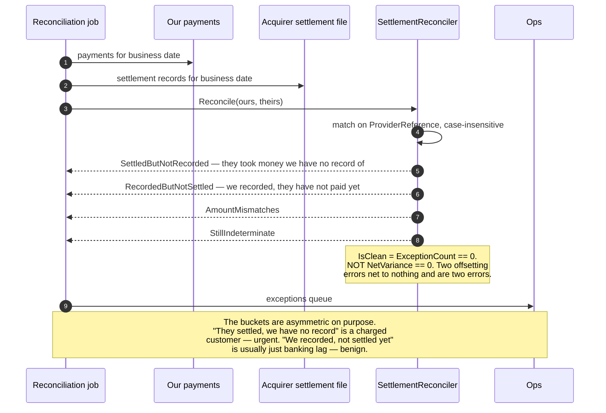
```mermaid
sequenceDiagram
    autonumber
    participant J as Reconciliation job
    participant DB as Our payments
    participant F as Acquirer settlement file
    participant R as SettlementReconciler
    participant Ops

    J->>DB: payments for business date
    J->>F: settlement records for business date
    J->>R: Reconcile(ours, theirs)

    R->>R: match on ProviderReference, case-insensitive

    R-->>J: SettledButNotRecorded — they took money we have no record of
    R-->>J: RecordedButNotSettled — we recorded, they have not paid yet
    R-->>J: AmountMismatches
    R-->>J: StillIndeterminate

    Note over R: IsClean = ExceptionCount == 0.<br/>NOT NetVariance == 0. Two offsetting<br/>errors net to nothing and are two errors.

    J->>Ops: exceptions queue
    Note over J,Ops: The buckets are asymmetric on purpose.<br/>"They settled, we have no record" is a charged<br/>customer — urgent. "We recorded, not settled yet"<br/>is usually just banking lag — benign.
```

`SettlementReconciler` is deliberately **pure**: two lists in, a report out, no
database and no clock. That is what makes the offsetting-errors case testable at all.
The job that feeds it — reading the acquirer's file on a schedule — is **not built**.

---

## 20. Order to stock, in two deliveries — the Phase 7 gate

The whole point of Phase 7 in one picture: what a buyer agreed, what actually turned up,
what it really cost, and what the supplier eventually asked for — four different numbers
that must each land in the right place.

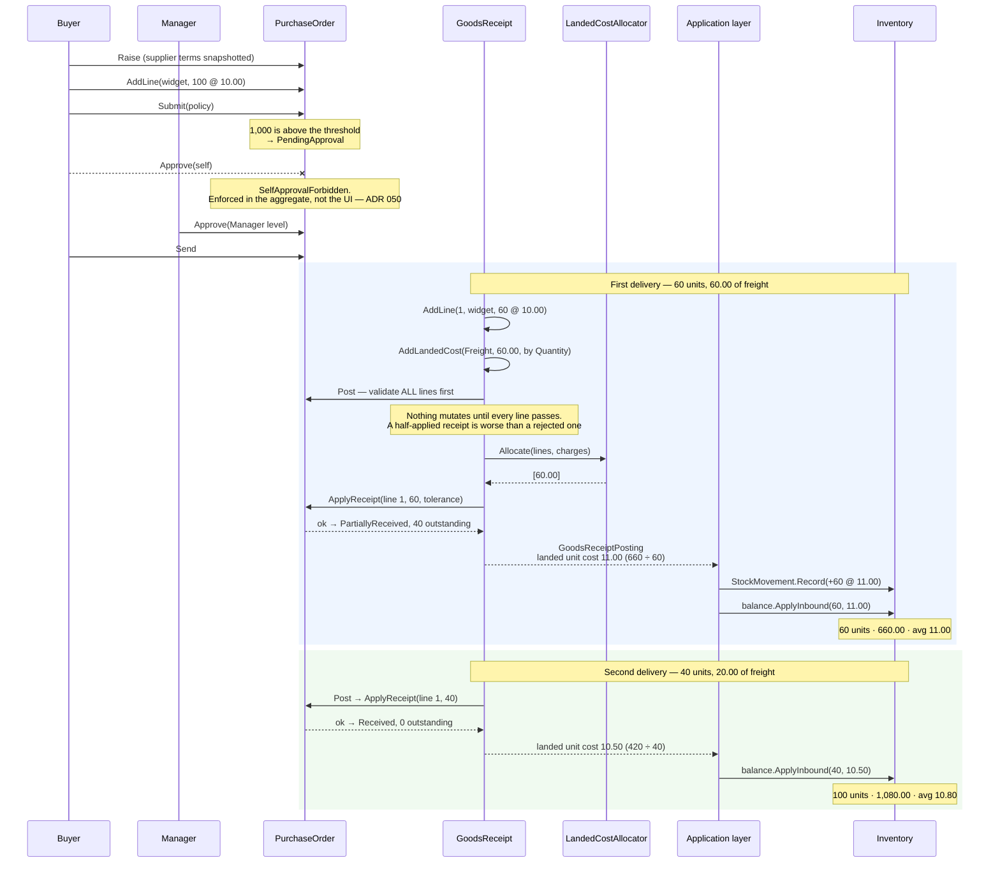
```mermaid
sequenceDiagram
    participant Buyer
    participant Mgr as Manager
    participant PO as PurchaseOrder
    participant GRN as GoodsReceipt
    participant Alloc as LandedCostAllocator
    participant App as Application layer
    participant Inv as Inventory

    Buyer->>PO: Raise (supplier terms snapshotted)
    Buyer->>PO: AddLine(widget, 100 @ 10.00)
    Buyer->>PO: Submit(policy)
    Note over PO: 1,000 is above the threshold<br/>→ PendingApproval

    Buyer--xPO: Approve(self)
    Note over PO: SelfApprovalForbidden.<br/>Enforced in the aggregate, not the UI — ADR 050
    Mgr->>PO: Approve(Manager level)
    Buyer->>PO: Send

    rect rgb(238, 245, 255)
    Note over GRN,Inv: First delivery — 60 units, 60.00 of freight
    GRN->>GRN: AddLine(1, widget, 60 @ 10.00)
    GRN->>GRN: AddLandedCost(Freight, 60.00, by Quantity)
    GRN->>PO: Post — validate ALL lines first
    Note over GRN: Nothing mutates until every line passes.<br/>A half-applied receipt is worse than a rejected one
    GRN->>Alloc: Allocate(lines, charges)
    Alloc-->>GRN: [60.00]
    GRN->>PO: ApplyReceipt(line 1, 60, tolerance)
    PO-->>GRN: ok → PartiallyReceived, 40 outstanding
    GRN-->>App: GoodsReceiptPosting<br/>landed unit cost 11.00 (660 ÷ 60)
    App->>Inv: StockMovement.Record(+60 @ 11.00)
    App->>Inv: balance.ApplyInbound(60, 11.00)
    Note over Inv: 60 units · 660.00 · avg 11.00
    end

    rect rgb(240, 250, 240)
    Note over GRN,Inv: Second delivery — 40 units, 20.00 of freight
    GRN->>PO: Post → ApplyReceipt(line 1, 40)
    PO-->>GRN: ok → Received, 0 outstanding
    GRN-->>App: landed unit cost 10.50 (420 ÷ 40)
    App->>Inv: balance.ApplyInbound(40, 10.50)
    Note over Inv: 100 units · 1,080.00 · avg 10.80
    end
```

The average is **10.80**. Not 10.00, which is what the order and the invoice both say, and
not 11.00, which is what the first delivery cost. Every downstream margin figure depends
on this arithmetic surviving two partial deliveries at different landed costs, which is
why it is asserted end to end in `PurchasingToInventoryWorkflowTests` rather than only
per-unit.

Note what the application layer does here, and that nothing forces it to. Purchasing hands
over plain instructions and Inventory is called separately (ADR 052). If that second call
is skipped, stock is wrong and no compiler will say so — which is why a receipt ↔ movement
reconciliation is on the outstanding list.

---

## 21. The invoice arrives, 1.5% high

```mermaid
sequenceDiagram
    participant Sup as Supplier
    participant Inv as PurchaseInvoice
    participant M as ThreeWayMatcher
    participant PO as PurchaseOrder
    participant GRN as Goods receipts
    participant AP as Accounts payable

    Sup->>Inv: Invoice SI-9910 — 100 @ 10.15
    Note over Inv: Recorded BEFORE matching.<br/>A disputed bill is still a bill

    Inv->>M: Match(order, receipts, invoice, tolerance)
    M->>GRN: quantity billed vs quantity RECEIVED
    Note over M,GRN: 100 billed, 60 + 40 received.<br/>Summed across partial deliveries — matching<br/>one receipt fails on every real supply chain
    M->>PO: unit price billed vs price AGREED
    Note over M,PO: 10.15 vs 10.00 = 1.5%, inside 2%.<br/>Checking price against the delivery note would let<br/>a supplier reprice by writing a new number on a docket
    M-->>Inv: MatchedWithinTolerance

    Note over Inv: Distinct from Matched, deliberately.<br/>A supplier permanently at 1.9% under a 2% tolerance<br/>is a commercial problem, invisible if both read "matched"

    Inv->>AP: Approve → payable
    Note over Inv: The 10.15 never touches stock value.<br/>Cost comes from the receipt, not the bill
```

Had nothing been received, the outcome would be `Blocked` no matter how generous the
tolerance. Tolerance absorbs measurement noise; it does not absorb goods that do not
exist.

---

## 22. Freight turns up three weeks late

```mermaid
sequenceDiagram
    participant Haulier
    participant Exp as Expense
    participant Late as LateLandedCostAllocator
    participant App as Application layer
    participant Inv as Inventory
    participant GL as (no General Ledger yet)

    Note over Inv: 100 units received at 10.00.<br/>50 have since been sold. 50 on hand, 500.00
    Haulier->>Exp: Freight invoice, 100.00
    Exp->>Exp: LinkToGoodsReceipt(GRN-0001)
    Note over Exp: Permitted — Freight is capitalisable.<br/>Utilities would be refused here — ADR 055

    App->>Inv: read balance → 50 on hand
    App->>Late: Split(100.00, received 100, on hand 50)
    Late-->>App: Revaluation 50.00 · Variance 50.00

    App->>Inv: RecordValueAdjustment(+50.00)
    Note over Inv: CostAdjustment — quantity 0, value only.<br/>ADR 047 exists for exactly this movement
    App->>Inv: balance.ApplyValueAdjustment(+50.00)
    Note over Inv: 50 units · 550.00 · avg 11.00

    App--xGL: Variance 50.00
    Note over GL: Nowhere to post it. Carried on the<br/>document for later export — unfinished work
```

The 50.00 of variance stays wrong forever on the units already sold. That is the deliberate
trade in ADR 049: a permanently slightly-wrong closed period, rather than a period that
reopens every time a haulier is slow with paperwork.

The three edge cases are decided, not emergent. More on hand than was received is capped —
the excess came from later deliveries carrying their own freight. Negative stock is treated
as nothing on hand, because there are no units present to carry the cost, so the whole
charge becomes variance where somebody will see it. And an indivisible split goes through
`Money.Allocate`, so the two halves sum exactly to the charge.
